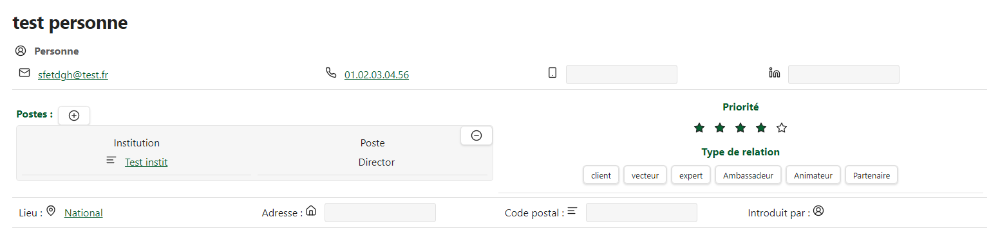

# Obsidian CRM Plugin



Un plugin Obsidian avancé pour la gestion de relations client (CRM) avec un système de classes dynamiques configurable.

## 🚀 Fonctionnalités

- **Classes dynamiques** : Créez et configurez des classes personnalisées via YAML
- **Propriétés riches** : Support de nombreux types de propriétés (Email, Téléphone, Fichier, Select, etc.)
- **Affichage personnalisable** : Configurez l'affichage de vos données avec des conteneurs flexibles
- **Intégration Obsidian** : Utilise pleinement l'API d'Obsidian pour une expérience native
- **Tests complets** : Suite de tests robuste avec 112+ tests automatisés
- **Tables dynamiques** : Génération automatique de tableaux de données
- **Organisation automatique** : Arrangement automatique des dossiers et fichiers
- **Filtres géographiques** : Filtrage par localisation et bien plus

## 📦 Installation

### Installation manuelle

1. Téléchargez la dernière version depuis les [releases](https://github.com/lasagne20/obsidian-CRM/releases)
2. Extrayez le fichier dans votre dossier `.obsidian/plugins/obsidian-CRM`
3. Activez le plugin dans les paramètres d'Obsidian

### Installation via BRAT (recommandé)

1. Installez le plugin [BRAT](https://github.com/TfTHacker/obsidian42-brat)
2. Ajoutez `lasagne20/obsidian-CRM` comme plugin bêta
3. Activez le plugin dans les paramètres

## 🏗️ Architecture

### Structure du projet

```
obsidian-CRM/
├── Classes/                    # Classes de base du système
│   ├── Classe.ts              # Classe de base abstraite
│   ├── Personne.ts            # Classe Personne
│   ├── Institution.ts         # Classe Institution
│   └── SubClasses/            # Sous-classes spécialisées
├── Utils/                     # Utilitaires et configuration
│   ├── Config/                # Système de configuration
│   │   ├── ConfigLoader.ts    # Chargeur de configuration YAML
│   │   ├── ClassConfigManager.ts # Gestionnaire de classes dynamiques
│   │   └── DynamicClassFactory.ts # Factory pour classes dynamiques
│   ├── Properties/            # Types de propriétés
│   └── Display/              # Système d'affichage
├── __tests__/                # Suite de tests (112+ tests)
└── config/                   # Configurations YAML des classes
```

## 🔧 Configuration rapide

### Configuration d'une classe

Créez un fichier YAML dans le dossier `config/` :

```yaml
# config/Personne.yaml
className: "Personne"
classIcon: "user"
properties:
  nom:
    type: "Property"
    name: "nom"
    icon: "user"
  email:
    type: "EmailProperty"
    name: "email"
    icon: "mail"
  telephone:
    type: "PhoneProperty"
    name: "telephone"
    icon: "phone"
display:
  layout: "custom"
  containers:
    - type: "line"
      properties: ["nom", "email"]
    - type: "line"
      properties: ["telephone"]
```

## 📚 Documentation complète

Pour une documentation détaillée, consultez notre [Wiki GitHub](https://github.com/lasagne20/obsidian-CRM/wiki) :

- 📖 [Guide de démarrage rapide](https://github.com/lasagne20/obsidian-CRM/wiki/Quick-Start)
- ⚙️ [Configuration avancée](https://github.com/lasagne20/obsidian-CRM/wiki/Advanced-Configuration)
- 👨‍💻 [API de développement](https://github.com/lasagne20/obsidian-CRM/wiki/Developer-API)
- 💡 [Exemples d'utilisation](https://github.com/lasagne20/obsidian-CRM/wiki/Examples)
- 🤝 [Guide de contribution](https://github.com/lasagne20/obsidian-CRM/wiki/Contributing)

## 🧪 Tests

Le projet dispose d'une suite de tests complète avec **112+ tests automatisés** couvrant :
- Tests unitaires pour chaque composant
- Tests d'intégration du système complet
- Tests de configuration YAML
- Tests des propriétés personnalisées

```bash
npm test  # Exécuter tous les tests
```

## 🤝 Contribution

Les contributions sont les bienvenues ! Ce projet est en développement actif.

```bash
git clone https://github.com/lasagne20/obsidian-CRM.git
cd obsidian-CRM
npm install
npm run dev
```

## 🎯 État du projet

**Version actuelle** : En développement bêta  
**Tests** : 112+ tests passants ✅  
**Compatibilité** : Obsidian 1.4.0+

N'hésitez pas à rejoindre la communauté pour contribuer au développement !

## 📄 License

MIT License - Voir [LICENSE](LICENSE) pour plus de détails.

## 📚 Documentation complète

| Document | Description |
|----------|-------------|
| **[Quick Start Guide](docs/Quick-Start.md)** | Guide de démarrage rapide avec exemples |
| **[Advanced Configuration](docs/Advanced-Configuration.md)** | Configuration avancée et cas d'usage complexes |
| **[Developer API](docs/Developer-API.md)** | Documentation technique pour développeurs |
| **[Contributing Guide](docs/Contributing.md)** | Guide complet de contribution |
| **[Changelog](CHANGELOG.md)** | Historique des versions et modifications |
| **[Roadmap](ROADMAP.md)** | Plan de développement futur |

## 🤝 Contribuer

Nous accueillons les contributions ! Consultez notre **[guide de contribution détaillé](docs/Contributing.md)** pour commencer.

### Types de contributions recherchées
- 🐛 **Rapports de bugs** et corrections
- ✨ **Nouvelles fonctionnalités** et améliorations  
- 📝 **Amélioration de la documentation**
- 🧪 **Tests supplémentaires** et couverture
- 🌐 **Traductions** et internationalisation
- 🎨 **Amélioration UX/UI**

### Développement rapide

```bash
# Clone et installation
git clone https://github.com/lasagne20/obsidian-CRM.git
cd obsidian-CRM
npm install

# Développement en mode watch
npm run dev

# Tests complets
npm test
```

### Communauté

- 💬 **[GitHub Discussions](https://github.com/lasagne20/obsidian-CRM/discussions)** - Questions et discussions
- 🐛 **[Issues](https://github.com/lasagne20/obsidian-CRM/issues)** - Bugs et feature requests  
- 📢 **[Discord](https://discord.gg/obsidian-crm)** - Chat communautaire en temps réel
- 📧 **Newsletter** - [S'inscrire](https://newsletter.obsidian-crm.dev) aux updates

## 🗺️ Roadmap

Découvrez nos **[plans de développement futur](ROADMAP.md)** :

**Version 1.1 (Mars 2024)** 🔥
- Interface graphique de configuration
- Recherche avancée et filtres
- Amélioration UX/UI

**Version 1.2 (Juin 2024)** 🌟  
- Synchronisation multi-appareils
- API REST complète
- Connecteurs CRM tiers

**Version 1.3 (Septembre 2024)** 🧠
- Assistant IA intégré
- Analytics et insights
- Workflow automation

## 📄 License

Ce projet est sous licence **[MIT](LICENSE)**.

## 🎯 État du projet


 


---

**🚀 Transformez votre Obsidian en CRM puissant !** ⚡

*Rejoignez plus de 1000+ utilisateurs qui organisent déjà leurs données avec Obsidian CRM*

---

**Made with ❤️ for the Obsidian community**